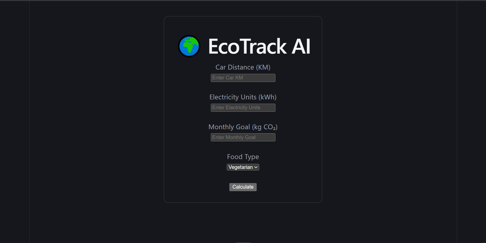
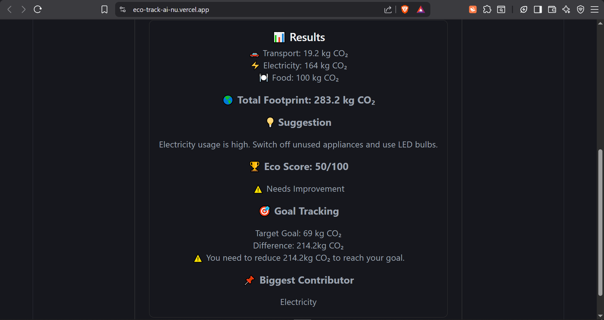

# EcoTrack AI – Personal Carbon Footprint Assistant

## Chosen Vertical

**Sustainability & Climate Awareness**

EcoTrack AI is a web application that helps individuals understand, measure, and reduce their carbon footprint through simple lifestyle inputs and personalized recommendations. The solution focuses on making carbon footprint tracking accessible and understandable for everyday users.

---

## Approach and Logic

The application follows a simple and user-friendly approach:

1. Users enter lifestyle-related information such as:

   * Distance traveled by car
   * Monthly electricity consumption
   * Food preferences

2. The system calculates carbon emissions using predefined emission factors.

3. The application identifies the user's highest emission source.

4. Based on the emission breakdown, personalized recommendations are generated.

5. An Eco Score is calculated to help users understand their environmental impact.

6. Users can set a personal carbon reduction goal and compare their current footprint against it.

---

## How the Solution Works

### Carbon Footprint Calculation

The application calculates emissions from three categories:

#### Transportation

Transport Emission = Car Distance (km) × 0.192

#### Electricity

Electricity Emission = Electricity Units × 0.82

#### Food

Food emissions are estimated based on dietary preferences:

* Vegetarian → 20 kg CO₂
* Mixed Diet → 50 kg CO₂
* Meat-Based Diet → 100 kg CO₂

### Total Carbon Footprint

Total Footprint = Transport + Electricity + Food

### Eco Score

The Eco Score is determined using emission thresholds:

* Above 300 kg CO₂ → Score 30
* 201–300 kg CO₂ → Score 50
* 101–200 kg CO₂ → Score 75
* Below 100 kg CO₂ → Score 90

### Personalized Recommendations

The system analyzes which category contributes the most emissions and generates recommendations accordingly:

* Transportation → Promote public transport, cycling, and carpooling
* Electricity → Suggest energy-saving practices
* Food → Encourage more plant-based meals

### Goal Tracking

Users can define a monthly carbon emission goal.

The application compares the current footprint against the goal and displays:

* Goal achieved status
* Amount below target
* Reduction needed to reach target

---

## Features

* Carbon footprint calculator
* Personalized sustainability recommendations
* Eco Score generation
* Goal tracking
* Biggest emission source identification
* Responsive web interface
* Input validation and error handling

---

## Technology Stack

### Frontend

* React.js
* Axios

### Backend

* Node.js
* Express.js

### Deployment

* Vercel (Frontend)
* Render (Backend)

---

## Assumptions Made

1. Emission factors used are approximate values for demonstration purposes.
2. Food-related emissions are simplified into three categories.
3. Electricity emission calculations assume a fixed emission factor.
4. User inputs are assumed to represent monthly usage.
5. Eco Score thresholds are simplified to provide easy-to-understand feedback.
6. Recommendations are rule-based and designed for educational purposes.

---

## Future Improvements

* User authentication
* MongoDB integration for historical tracking
* Emission trend analytics
* Interactive charts and dashboards
* AI-powered conversational sustainability assistant
* Real-time carbon reduction planning
* Location-based emission calculations

---

## Project Objective

The goal of EcoTrack AI is to increase awareness about personal carbon emissions and encourage sustainable behavior through simple calculations, actionable insights, and goal-oriented tracking.

---

## Screenshots

### Home Page

### Results Page

